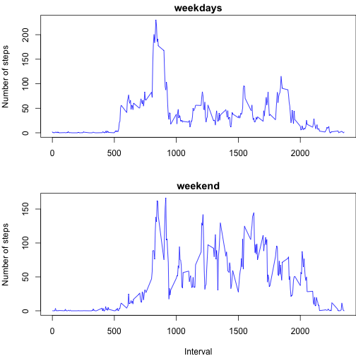

## Loading and preprocessing the data


```r
setwd("/Users/fgrande/Desktop/Repr_res_Assign1/RepData_PeerAssessment1")
x<-read.csv("activity.csv")
head(x)
```

```
##   steps       date interval
## 1    NA 2012-10-01        0
## 2    NA 2012-10-01        5
## 3    NA 2012-10-01       10
## 4    NA 2012-10-01       15
## 5    NA 2012-10-01       20
## 6    NA 2012-10-01       25
```

## What is mean total number of steps taken per day?
Draw the histogram of the number of steps taken per day, with chosen breaks=20.


```r
hist(tapply(x$steps,x$date,sum,na.rm=TRUE),breaks=20,main="Steps taken every day",xlab="Number of steps in a day",ylab="Frequency")
```

 

Compute the summary of the data related to the number of steps per day. The data include the mean and the median.


```r
s<-summary(tapply(x$steps,x$date,sum,na.rm=TRUE))
s["Mean"]
```

```
## Mean 
## 9354
```

```r
s["Median"]
```

```
## Median 
##  10400
```
## What is the average daily activity pattern?
Compute the vector of means per by intervals of 5 minutes

```r
v<-tapply(x$steps,x$interval,mean,na.rm=TRUE)
```
Time series plot:

```r
plot(names(v),as.numeric(v),type="l",xlab="5-minutes interval", ylab="Number of steps")
```

 

Identify the interval of 5 minutes with the highest mean:


```r
names(which.max(v))
```

```
## [1] "835"
```

## Imputing missing values
Identifies the rows with not assigned number of steps and print their total number


```r
x2na<-is.na(x$steps)
length(x2na[x2na==TRUE])
```

```
## [1] 2304
```
We will replace each missing value of a 5-minutes interval with the mean of that particular 5-minutes interval.

Create a copy x2 of the original data frame x and fill in the missing values according the explained strategy.


```r
x2<-x
x2$steps[x2na]<-as.numeric(v[as.character(x$interval[x2na])])
head(x2)
```

```
##       steps       date interval
## 1 1.7169811 2012-10-01        0
## 2 0.3396226 2012-10-01        5
## 3 0.1320755 2012-10-01       10
## 4 0.1509434 2012-10-01       15
## 5 0.0754717 2012-10-01       20
## 6 2.0943396 2012-10-01       25
```

Draw the histogram of the total number of steps taken every day for data frame x2


```r
hist(tapply(x2$steps,x2$date,sum,na.rm=TRUE),breaks=20,main="Steps taken per day, with missing values completion",xlab="Number of steps",ylab="Frequency")
```

 

Compute mean and median of the number of steps taken every day for x2.


```r
s2<-summary(tapply(x2$steps,x2$date,sum,na.rm=TRUE))
s2["Mean"]
```

```
##  Mean 
## 10770
```

```r
s2["Median"]
```

```
## Median 
##  10770
```

```r
s2
```

```
##    Min. 1st Qu.  Median    Mean 3rd Qu.    Max. 
##      41    9819   10770   10770   12810   21190
```
The completion of missing values does actually change the mean and the median. Both values increase and in the completed data frame they coincide.


## Are there differences in activity patterns between weekdays and weekends?
Convert the column of dates in date format and add the additional column to differentiate weekdays and weekend days.


```r
x2$date<-as.Date(x2$date)
l<-weekdays(x2$date)
l[l=="Saturday"|l=="Sunday"]<-"weekend"
l[l!="weekend"]<-"weekday"
x2$daytype<-l
head(x2)
```

```
##       steps       date interval daytype
## 1 1.7169811 2012-10-01        0 weekday
## 2 0.3396226 2012-10-01        5 weekday
## 3 0.1320755 2012-10-01       10 weekday
## 4 0.1509434 2012-10-01       15 weekday
## 5 0.0754717 2012-10-01       20 weekday
## 6 2.0943396 2012-10-01       25 weekday
```

Separate data for weekdays and data for weekend days


```r
v2<-tapply(x2[x2$daytype=="weekday","steps"],x2[x2$daytype=="weekday","interval"],mean,na.rm=TRUE)
v3<-tapply(x2[x2$daytype=="weekend","steps"],x2[x2$daytype=="weekend","interval"],mean)
```

Plot the data for the weekdays in red and the data for the weekend day in blue.


```r
par(mfrow=c(2,1),mar=c(4,4,1.5,0))
plot(names(v2),as.numeric(v2),type="l",col="blue",xlab="",ylab="Number of steps",main="weekdays")
plot(names(v3),as.numeric(v3),type="l",col="blue",xlab="Interval",ylab="Number of steps",main="weekend")
```

 
